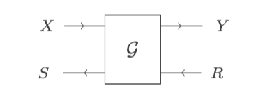
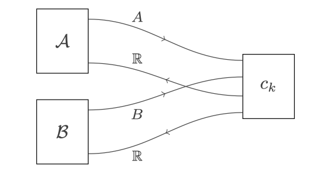
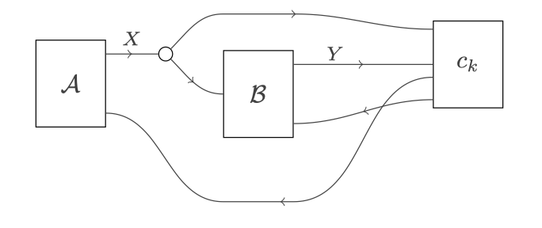
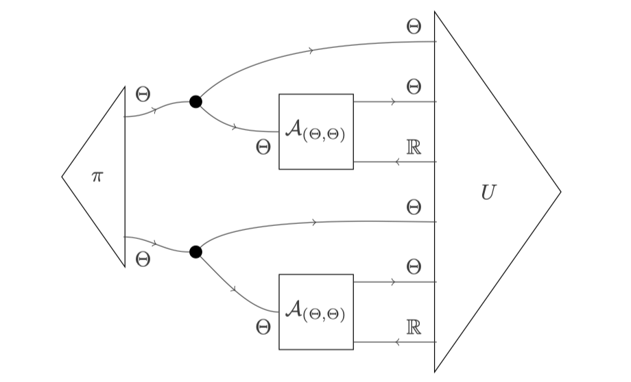

## Introduction

This repo is based on a new mathematical foundation of economic game theory. We developed the theory in the last years. The most relevant articles are:

* [Compositional game theory](https://arxiv.org/abs/1603.04641) by Ghani, Hedges, Winschel and Zahn
* [Bayesian open games](https://arxiv.org/abs/1910.03656) by Bolt, Hedges and Zahn

See also Jules Hedges' [webpage](https://julesh.com/2017/11/09/compositional-game-theory-reading-list/) which contains further resources.

The essential innovation is the decomposition of strategic interactions into atomic components. These components can be assembled through a fixed set of operations while guaranteeing that the result is well-behaved -- i.e. forms a proper *open game*.

The software has two main components: (i) it enables users to represent strategic interactions and (ii) it enables them to analyze these games, typically checking whether a particular strategy is in equilibrium.

NOTE: In its current form, compositional game theory is essentially a programmable reincarnation of classical game theory. The models you can generate with it can also be generated with classical game theory. What is different is *how* one approaches that modelling task: it becomes a programming task.

This has two main consequences:

Hence: What we get here is mostly good ol' game theory -- but in a very different form. If you expect a "different" kind of theory, you are (for now) looking in the wrong place. If you are looking for "new" theory (i.e. proving novel theorems), you are also in the wrong place.

### Intended Audience - required background knowledge

This tutorial is directed towards _applied modellers_ who want to use the software for modelling of concrete situations. We do not give a detailed explanation how the engine works. If you are interested in that, please check out ...

Some knowledge of Haskell is helpful as we are implementing some auxiliary stuff (like utility functions) in Haskell. However, this is mostly about defining functions which should be not too hard to grasp even without knowledge of Haskell.

### Current Limitations

* Focus of the engine is on BayesianGames
* Repeated games are not possible (but Markov games will be soon)
* This engine is not (yet) optimized for performance

Progress on all of these fronts is happening. But we are not there yet.

## Representation of Games

### Basic structure of an _open game_

The theory of open games is developed in a particular category theoretic structure which allows representations in terms of _string diagrams_. These are essentially two-dimensional diagrammatic representations of interactions.

Essentially, all elements in a strategic interaction are translated into computations. These computations are two-way information transformers. They take information from the left (X) and from the right (R) as inputs and transform them into outputs - also in both directions (Y and S).

At a high level, the modelling task is to plug these components together such that the assembled object represents the intended interaction. You can think of this modelling as "plumbing together" the information flow of an interaction.  Here is a simple example of a simultaneous move game with two players -- essentially a standard bimatrix game like the Prisoner's Dilemma.

Here is an example of a sequential game with two players. That is, one player moves first, the second player observes the first player's move and then makes a decision.

And lastly, here is an example of an auction where the two bidders have private information about their evaluation for the good.

We will not dwell much on the technical details behind these graphical representations. What is important though (and what you should take away from the pictures at this stage): The graphical language operates in two dimensions. In the bimatrix case players 1 and 2 are put side-by-side as they move simultaneously. They are still connected though as their utility is affected not only by their own action but also by the action of the other player.

Obviously, there is still significant information missing such as what exactly are the strategies the players can choose? What are the payoffs etc?

We will come to that.

So far it is important to note, there is a way of stitching together the different components which mainly works along two time dimensions: simultaneous and sequential composition.

### Types

You may wonder what the restrictions are when we want to plug games together. Obviously, arbitrary combinations do not make much sense. The solution to this are _types_. If you do not know about what types are, you can think of some as a tag to each wire. The tag tells us what kind of object we are dealing with. Only equally-tagged games can be connected.

These tags are important as they also play a major role in programming games. In fact, our software will prevent you from composing games where the tags do not match. You will get what is called a type error.

### Programming syntax

The graphical representation is useful as one gets a quick perspective on what the information actually is. Moreover, turning towards our actual goal, namely program these interactions, it is important to note one challenge that we face (and which will pervade throughout the programming): The graphical syntax is two-dimensional but like most programming languages, our code must be one-dimensional.

Hence, we need a way to flatten the two dimensions into one. We achieve this by cutting the two dimensions into parts, sequentialize these components, and connect them through variables. Bear this in mind; hopefully this makes it easier to grasp what is going on.

The syntax for programming has two parts, an _outside perspective_ and an _inside perspective_. Let us begin with the outside perspective.

        _NameOfGame_ _var1_ _var2_ ... _varN_ = [opengame|

            inputs    : _InputGame_ ;                    -- This corresponds to X in the diagram
            feedback  : _FeedbackGame_ ;                 -- This corresponds to S in the diagram
            :-------------------------:

            INTERNALS OF THE GAME

            :-------------------------:
            output    : _OutputToOutside_ ;              -- This corresponds to Y in the diagram
            returns   : _ResultsReceivedFromOutside_ ;   -- This corresponds to R in the diagram

        |]

The above expression is a declaration of an open game. You can think of it as a large (possibly constant) function. That is, on the left hand side of the equation you provide the name of the game `_NameOfGame_` as well as possible arguments that the game depends on `_var1_ ,...`. Think of the arguments as exogenous parameters on which the game depends such as utility functions, cost functions, discount factors, name of players etc.

Regarding the right hand side of the equation, the `[opengame| ... |]` is the syntax that contains the relevant information to define an open game. The internals are seperated from the externals through two separating lines `:---:`.

For now, we focus on the external parts. Recall the diagram above. The outside perspective corresponds to having the box with 4 wires. Hence, we need to provide inputs/outputs. In many cases this will boil down to assigning variable names to make clear on which information a game does depend on.

Let us now turn to the internal structure. It has the following shape:

        :-------------------------:

        inputs    : x ;                                                  --\
        feedback  : f ;                                                     \
        operation : dependentDecision _playerName_ _actionSpace_ ;           ==> LineBlock 1
        outputs   : y ;                                                     /
        returns   : payoffFunction x y (...) ;                           --/

        inputs    : a ;                                                  --\
        ...                                                                 \
        ...                                                                  ==> LineBlock 2
        ...                                                                 /
        ...                                                              --/

        ...

        :-------------------------:

The internals of an open game consists of one or more _LineBlocks_. Each LineBlock consists of five fields.
It is not accidental that the internal structure closely resembles the outer structure. There are also four input/output fields.

NOTE: For the compiler to work, the order of the fields must be kept intact. For instance, `operation` has to preceed `returns`. However, fields are optional. That is, if, for instance, there is no input, one ignore that field.

Recall that our goal is to model each component as a possible standalone open game which can be connected.
The main difference between the outer and inner layer is that each LineBlock requires an _operation field_. This is where information is actually transformed or generated. We will see several canonical operations that one can use. This includes, as depicted in the box above, a decision operator which -- given some possible prior observation, an action space (i.e. a list of possible actions to take), and information that is returned (his payoff) -- models a single agent who chooses an action.

What action? For now, you can think about the agent maximizing his expected payoffs. In principle, we can also consider other decision criteria. But for simplicity, we will stick to the maximization for now.

It is crucial to realize that there is a "gap" between the decision operation and the return field. When we speak of maximization of payoffs, the objective function is typically a payoff function. Yet, you may wonder: In a strategic situation the decisions of others matter. Otherwise, what is the whole point, right?

But as indicated above with `(...)` in the returns field, the payoff function can rely on other inputs from outside that single LineBlock, e.g. another player making a move.

It is your task as a modeller to make this dependency explicit. The compiler in the back then takes care of threading the needed information together. This also gives you a first rule of thumb how to approach modelling in our language. Whenever there needs to be an explicit modelling of decisions, payoffs etc., you will typically model that parts in terms of the internals of a game.

NOTE: We expect that the syntax above is easier to grasp for people without much background knowledge in certain aspects of Haskell (you tell us!). For those familiar with Arrow Syntax (see, e.g. [here](https://www.haskell.org/arrows/)), there is an alternative way available which we detail in the [LINK BROKEN](#alternative-syntax).

### Building blocks

After having laid out the basic structure of how an open game looks like, a natural question is what is the universe of operations that one can supply?

Of course, there is no conclusive answer as one can introduce new operators. You can cook together your own components. After all, that is the whole point of modelling through programming.

But one needs to start somewhere. So, here is a basic list of three things you might want to do. In our experience that gets you a long way.

* decisions

* functions

* moves of nature

We will cover each of them.

#### Decisions

Decisions are one of the central building blocks for compositional game theory. They model a single player.

We consider two variants depicted below.

        decision actionSpace payoffFunction playerName = [opengame|

            inputs    : x ;
            feedback  :   ;

            :-----:
            inputs    : x ;
            feedback  :   ;
            operation : dependentDecision playerName (\y -> actionSpace) ;
            outputs   : y ;
            returns   : payoffFunction y x r ;
            :-----:

            outputs   : y ;
            returns   : r ;

        |]

 The `decision` game is a parameterized decision problem which requires three external parameters: An action space, a payoff function and a player name. The latter is just a string. It is needed to identify a player in a larger game and to knit different payoffs at different stages together. Moreover, as a side effect when we come to the analysis part of a game, names help to structure the analytics which we can derive from a game.

Here is the second version:

        decisionNoObs actionSpace payoffFunction playerName = [opengame|

            inputs    :   ;
            feedback  :   ;

            :-----:
            inputs    :   ;
            feedback  :   ;
            operation : dependentDecision playerName (\y -> actionSpace) ;
            outputs   : y ;
            returns   : payoffFunction y r;
            :-----:

            outputs   : y ;
            returns   : r ;

        |]

The difference is that the second version does not require a prior observation. This becomes handy when modelling, for instance, simultaneous move games where players do not observation anything prior to their decision.

#### Functions

What is special about functions is that they represent non-strategic objects. They are transforming information without adding strategic content.

Recall, an open game in general has two inputs and two outputs on each side of the box, mirroring the flow of information in two directions: past (left in the diagram) to future (right in the diagram). As we have two possibilities in which we can transform information (from past to future and from the future to the past), we also have two functions operators.

        forwardFunction function = [opengame|

            inputs    : x ;
            feedback  :   ;

            :-----:
            inputs    :   ;
            feedback  :   ;
            operation : fromFunctions function id ;
            outputs   : y ;
            returns   :   ;
            :-----:

            outputs  : y ;
            returns  :   ;

        |]

`forwardFunction` transforms information from the past into the future. It requires as an input a function. If you wonder about a practical example, think about a voting game where a number of players vote on an outcome.

The exact voting rule can then be modelled as a `forwardFunction` game taking as inputs the votes and outputting a result. To foreshadow some "design patterns" of how you want to go about modelling in this framework, let us consider why you would want to lift the voting rule to an open game.

There are other ways of modelling the voting rule. We could add it as an additional LineBlock to the players (we will discuss an example and the different consequences below). However, it may makes sense to embed the voting rule in an open game as it then can also be switched out easily against a different component. Say, the voting rule entails a random draw in case of a tie. And now you want to consider a different voting rule in which a specific player is pivotal in the case of tie (similar to the US Vice-President in the Senate).

Thus you want to turn a previously non-strategic component into a strategic component. In that case you can just switch out that LineBlock in the representation -- and you are done. Thus as rule-of-thumb. If you model an interaction and you consider turning elements into more complicated, strategic components later but want to go for something simpler first, modelling these components as own open games eases modular substitution with other components down the road. We will see more of this kind of discussion below.

As promised there is a second function operation.

        backwardFunction function = [opengame|

            inputs    :   ;
            feedback  : s ;

            :-----:
            inputs    :   ;
            feedback  :   ;
            operation : fromFunctions id function ;
            outputs   : s ;
            returns   : r ;
            :-----:

            outputs  :    ;
            returns  :  r ;

        |]

`backwardFunction` transforms input from the future into output to the past. You may find that weired at first. Why do we want to transform information back from the future? But consider a player who makes decisions over time. One application of the `backwardFunction` in that context is that we use it to transform the payoffs from the future, i.e. we can discount it. Or, say an agent receives transfers from multiple agents who move after him. Then we can use `backwardFunction` to aggregate these transfer according to some rule.

NOTE: Both, `forwardFunction` and `backwardFunction` require a function as input. Thus, one can also think about this type of open game as a "lifting" of a standard function into an open game.

#### Moves of nature

Many interesting games contain elements of chance. Moreover, the traditional approach to model games of uncertainty a la Harsanyi requires moves of nature which determine the players' types.

There are two ways in which you can embed nature into the game. Let us begin with the simplest one:

        natureDraw distribution =  [opengame|

            inputs    :   ;
            feedback  :   ;

            :-----:
            inputs    :   ;
            feedback  :   ;
            operation : nature distribution ;
            outputs   : draw ;
            returns   :   ;
            :-----:

            outputs  :  draw  ;
            returns  :    ;

        |]

`natureDraw` takes a probability distribution as input and outputs a single draw from that distribution.

        liftStochasticForward process =  [opengame|

            inputs    : x ;
            feedback  :   ;

            :-----:
            inputs    : x ;
            feedback  :   ;
            operation : liftStochastic process;
            outputs   : draw ;
            returns   :   ;
            :-----:

            outputs   : draw  ;
            returns   :   ;

        |]

`liftStochasticForward` is generalized version of `natureDraw` as it implements a functional stochastic process.[^liftStoch] It is also a generalization of `forwardFunction` which only allows deterministic processes.

NOTE: We are still in the context of representing a strategic interaction. We mentioned above, one analogy is to think about the representation in terms of open games as a piping system. To push this analogy further, note that at this stage the piping is about "potentiality". So far, we are not creating any concrete information, we are just setting up how information would be flushed through our game.

We reiterate this here, as in our experience the probabilistic components introduced above can lead to confusion. The above `natureDraw` and `liftStochasticForward` are *not* specific draws. They represent stochastic processes before we draw from them.

Later, when we start analyzing games and, say, consider specific outcomes for a given strategies, we might indeed encounter specific draws from these processes. But not for now.

This also completes the open games specific constructions one needs for representing games. There is one last piece of thing we need to get you running: We need a way to specify payoff functions as well as stochastic processes. We will describe this in the next section.

#### Haskell auxiliaries

So far, our system is embedded in Haskell in a way that minimizes your direct contact with Haskell. In the future we may put that contact to actually zero. But for now, you will need to express some components in Haskell. Luckily, the elements we need are relatively simple.

Let us begin with the definition of functions. We need functions in order to describe the payoffs of players and to supply the `forwardFunction` as well as `backwardFunction` with inputs.

The syntax in Haskell is straightforward:

    functionName arg1 arg2 ... argN = functionBody

In Haskell you declare a function using the equal sign. On the left hand side you declare the name of the function first, followed by arguments. On the right hand side, you declare the function body using the available arguments. For instance, generating the average of two values:

    average x y = (x + y) / 2

Or, closer to home, a utility function for one player of the Prisoner's Dilemma:

    pdPayoffs x y | x == Cooperate && y == Cooperate = 3
                  | x == Cooperate && y == Defect    = 0
                  | x == Defect    && y == Cooperate = 4
                  | x == Defect    && y == Defect    = 1

(Not necessarily the most elegant way of defining such a function but hopefully easy to understand for people with no background in Haskell so far)

The second element needed is the feeding of stochastic processes. We make our lives very simple here: There are two convenience functions `uniformDist` as well as `distFromList` which help to build distributions.

`uniformDist` does what the name suggests. It creates a uniform distribution given some lists of inputs. For instance, for a dice you would define:

    dice = uniformDist [1,2,3,4,5,6]

To create a tailored, finite distribution you can use `distFromList` which expects a list of outcome, probability pairs. For example, a coin can be implemented as:

    coin = distFromList [("Heads", 1), ("Tails", 1)]

Here is another simple example of a distribution. We will use a version of it later in the Bayesian Updating Example (see next section).

    signal signalPrecision Heads = distFromList [(Heads,signalPrecision),(Tails, 1- signalPrecision)]
    signal signalPrecision Tails = distFromList [(Tails,signalPrecision),(Heads, 1- signalPrecision)]

This distribution expects two inputs: a parameter `signalPrecision` and the outcome of a coin throw. Given `Heads` (`Tails`), the `signal` then sends the correct input with probability `signalPrecision`. As the name suggests we can think about this distribution as a stochastic signal of some underlying state of the world.

Such functions can be integrated into games as an input to the operation field using the `liftStochasticForward` function:

    inputs    : draw     ;
    feedback  :      ;
    operation : liftStochasticForward (signal signalPrecision);
    outputs   : signalDraw ;
    returns   :      ;

This represents a LineBlock where given some initial `draw` from a distribution, a signal is sent forward. Note, the state input variable for `signal`, which above was either `Heads` or `Tails`, is not defined here. The `liftStochasticForward` function takes care of that and automatically takes the variables in the `inputs` field as the input to the function `signal` attached to `liftStochasticForward`.

## Examples

In the following, we consider a series of examples. We begin with decision problems as these are the building block for the games that come later. We also illustrate other essential modelling aspects that are needed again and again. It is best, if you go through the examples in the order as they are listed here.

[Single Decision](/src/Examples/Decision.hs) illustrates the main elements of modelling a single player making decisions. It also introduces how to model in a modular fashion and how to define strategies.

[Simultaneous move games](/src/Examples/SimultaneousMove.hs) illustrates how simultaneous decisions are modelled.

[Sequential move games](/src/Examples/SequentialMoves.hs) illustrates how sequential decisions are modelled and how the sequence of moves is reflected in the definition of strategies.

[Bayesian Updating](/src/Examples/Bayesian.hs) illustrates the Bayesian updating under the hood of the _dependentDecision_ operation. It also shows how to model stochastic processes.

### Branching games operation

### Piping together different modules: Voting game

## Analyzing Games

### Overview
TODO: Say something about the construction of the strategies

After all that work, what can you actually do with a game that is represented You can analyze it in different ways.

0. You can check whether a given strategy tuple (that you need to come-up with!) is an equilibrium. You will receive a message like this, if it is:

        ----Analytics begin----
        Strategies are in equilibrium
        NEWGAME:
        ----Analytics end----

and a message like this, if it is not:

        ----Analytics begin----
        Strategies are NOT in equilibrium. Consider the following profitable deviations:

        Player: player1
        Optimal move: 5.0
        Current Strategy: fromFreqs [(4.0,1.0)]
        Optimal Payoff: 0.0
        Current Payoff: -1.0
        Observable State: ()
        Unobservable State: "((),())

As you can see, the message contains information about the particular aspects of a specific strategy. It outputs such information for the whole strategy tuple.
If your game depends on outside parameters, you can check for a whole class of parameters

xxx

1. You can simulate the outcomes for a game given a strategy. And of course you can do all sorts of illustrations with that

xxx Simulate outcome for a specific game

xxx Tabulate outcomes for a game.

2. You can also try to solve a game, which means, given a game, you are trying to find an equilibrium. Now, there are limitations in what you can do here. Hard limitations in the sense that computing equilibria in general is a computationally very hard problem. Weak limitations in the sense that we have spent no (nada!) efforts to optimize the code for performance. This will change in the future but for now keep that in mind.

Here is an example:

### Supplying strategies
TODO Explain better Kleisli types used

If you want to check for equilibria, you need to supply strategies. The strategies you need to supply are akin to behavioral strategies in classical game theory. Which means that you need to supply a function for each move that can be made. Which means you need to know how to define functions in our system.

Note, that even if there are no previous moves, no previous information to observe on which a strategy would be conditioned, you still supply a function -- just a constant function. This may look strange at the beginning but in essence it helps to make the system over all more uniform. And do not worry! You will not notice it much because we provide syntactic sugar which allow you to forget about this if you want to.

NOTE: If you are familiar with game theory, then most what we describe here probably makes sense to you. After all, if we take the Ultimatum Game, what you have to supply for the receiver is a function: given the offer by the sender, should the receiver accept or reject? Similarly, in a Bayesian Game like an auction, if one player observes her type, her strategy is function from her type space into the allowed bids.

As many teachers of game theory can attest to, for beginning students it is often not so clear that a strategy often really is a function.

#### Construction of a single strategy

The strategies you need to supply are expected to be of a certain "shape" or more precisely, type:

     Kleisli Stochastic a b

This type is from a relatively advanced part of Haskell. You do not need to worry about it to much. The reason for its use in our framework is that it makes several problems easier.

At the same time it is probably not easiest to grasp what is going on.

#### Construction of the complete strategy tuple

In order to check an equilibrium, you need to supply a strategy for each player (and each occasion where a move can be made). So, once you have the construction for each single player working you still need to put them together into a "tuple".

For the combined strategies, we are essentially constructing a list. The construction is as such:

    stratTuple = strat1 ::- strat2 ::- ... ::- stratN ::- Nil

The `::-` is a particular list constructor (in other contexts of referred to as `cons`). The constructor takes a single element and adds it to an existing list, i.e.:

    _element_ ::- _existingList_

Note, each list has a `Nil` as a last element.

NOTE: In case you wonder, this is not the standard list implementation. In Haskell lists only allow elements of the same type. The list constructor above allows heterogenous types. The reason for this change is simple: The shape of strategies can differ starkly for different players. Some may be required to provide a single action, others a function which depends on several observations.

[^liftStoch]:
Note that the `liftStochastic` could be used to implement the `natureDraw` function by consider a constant stochastic process. Still, we think models are more transparent and easier to read if we distinguish between these two operations.
